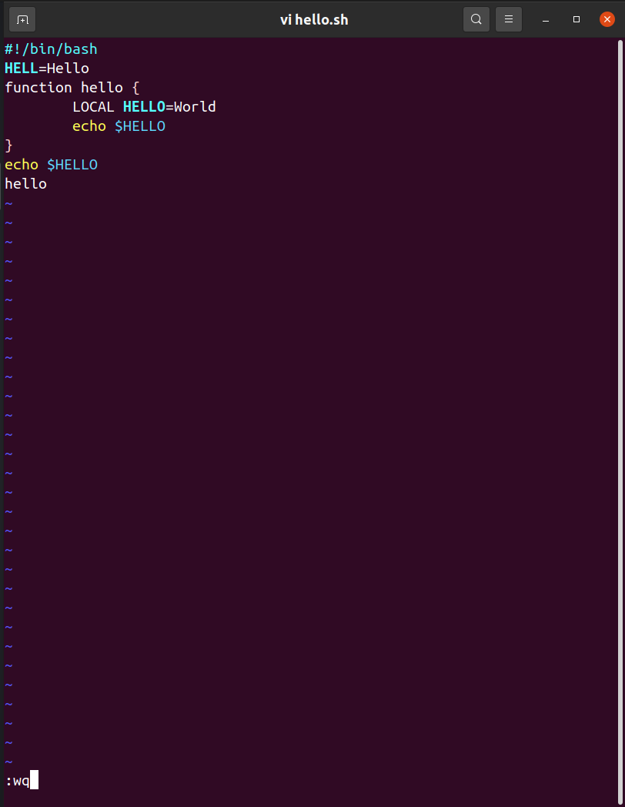

---
## Front matter
title: "Отчёт по лабораторной работе 8"
subtitle: "Редактор vi"
author: "Фомичева Маргарита Романовна"

## Generic otions
lang: ru-RU
toc-title: "Содержание"

## Bibliography
bibliography: bib/cite.bib
csl: pandoc/csl/gost-r-7-0-5-2008-numeric.csl

## Pdf output format
toc: true # Table of contents
toc-depth: 2
lof: true # List of figures
lot: true # List of tables
fontsize: 12pt
linestretch: 1.5
papersize: a4
documentclass: scrreprt
## I18n polyglossia
polyglossia-lang:
  name: russian
  options:
	- spelling=modern
	- babelshorthands=true
polyglossia-otherlangs:
  name: english
## I18n babel
babel-lang: russian
babel-otherlangs: english
## Fonts
mainfont: PT Serif
romanfont: PT Serif
sansfont: PT Sans
monofont: PT Mono
mainfontoptions: Ligatures=TeX
romanfontoptions: Ligatures=TeX
sansfontoptions: Ligatures=TeX,Scale=MatchLowercase
monofontoptions: Scale=MatchLowercase,Scale=0.9
## Biblatex
biblatex: true
biblio-style: "gost-numeric"
biblatexoptions:
  - parentracker=true
  - backend=biber
  - hyperref=auto
  - language=auto
  - autolang=other*
  - citestyle=gost-numeric
## Pandoc-crossref LaTeX customization
figureTitle: "Рис."
tableTitle: "Таблица"
listingTitle: "Листинг"
lofTitle: "Список иллюстраций"
lotTitle: "Список таблиц"
lolTitle: "Листинги"
## Misc options
indent: true
header-includes:
  - \usepackage{indentfirst}
  - \usepackage{float} # keep figures where there are in the text
  - \floatplacement{figure}{H} # keep figures where there are in the text
---

# Цель работы

- Познакомиться с ос Linux. Получить практические навыки работы с редактором vi, установленным по умолчанию практически во всех дистрибутивах.

# Ход работы 

## Создание нового файла с использованием vi
 
- Создаю каталог 

- Перехожу во вновь созданный каталог 

- Вызываю vi и создаю файл hello.sh

- Нажимаю клавишу i и ввожу нужный текст

- Нажимаю клавишу Esc для перехода в командный режим после ввода текста 

- Нажимаю клавишу : для перехода в режим последней строки

- Нажимаю w (записать) и q (выйти), а затем нажимаю Enter для сохранения текста и завершения работы

- Делаю файл исполняемым

## Редактирование существующего файла

- Вызываю vi на редактирование файла

- Устанавливаюкурсор в конец слова HELL второй строки

- Перехожу в режим вставки и заменяю на HELLO. Нажимаю Esc для возврата в командный режим

- Ставлю курсор на четвёртую строку и стираю слово LOCAL 

- Перехожу в режим вставки и набераю следующий текст: local, нажимаю Esc для возврата в командный режим

- Ставлю курсор на последнюю строку файла. Вставляю после неё строку, содержащую следующий текст: echo $HELLO

- Нажимаю Esc для перехода в командный режим

- Удаляю последнюю строку (d d)

- Ввожу команду отмены изменений u для отмены последней команды

- Ввожу символ : для перехода в режим последней строки. Записываю произведённые изменения и выхожу из vi

# Вывод

- Я познакомилась с ос Linux, получила практические навыки работы с редактором vi, установленным по умолчанию практически во всех дистрибутивах.

# Ответы на контрольные вопросы 

## Краткая хар-ка режимов работы vi

- Командный режим - для ввода команд редактирования и навигации по редактируемому файлу

- Режим вставки - для ввода содержания редактируемого файла

- Режим последней строки - для записи изменений в файл и выхода из редактора 

## Как выйти из редактора, не сохраняя изменения?

- :q!
 
## Краткая хар-ка командам позиционирования

- 0 - переход в начало строки 

- $ - переход в конец строки

- G - переход в конец файла

- n G - переход на строку с номером n

## Что для редактора vi является словом?

- Пробел, буквы, находящиеся между двумя пробелами

## Как из любого места редактируемого файла перейти в начало или конец файла?

- С помощью клавиши G и курсора вниз, вначало - курсор вверх

## Назовите и дайте краткую хар-ку основным группам команд редактирования

## Необходимо заполнить строку символами $. Каковы ваши дей-я?

- Можно использовать клавиши ni (вставить текст n раз)

## Как отменить некорректное дей-е, связанное с процессом редакт-я?

- С помощью клавиши "."

## Как определить, не перемещая курсора, позицию, в которой заканчивается строка?

- Используя клавишу $

## Как определить режим работы редактора?

- По последней командной строке

## Постройте граф взпимосвязи режимов работв редактора

- Командный режим - Режим вставки - РЕжим командной строки 
