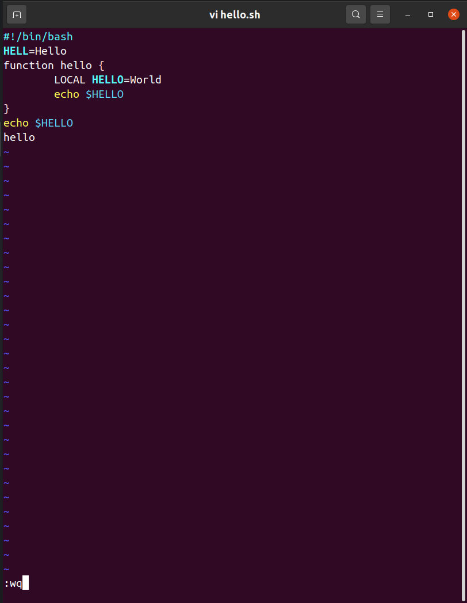
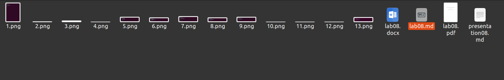

---
## Front matter
lang: ru-RU
title: Презентация по лабораторной работе 8
author: |
	Leonid A. Sevastianov\inst{1,3}
	\and
	Anton L. Sevastianov\inst{1}
	\and
	Edik A. Ayrjan\inst{2}
	\and
	Anna V. Korolkova\inst{1}
	\and
	Dmitry S. Kulyabov\inst{1,2}
	\and
	Imrikh Pokorny\inst{4}
institute: |
	\inst{1}RUDN University, Moscow, Russian Federation
	\and
	\inst{2}LIT JINR, Dubna, Russian Federation
	\and
	\inst{3}BLTP JINR, Dubna, Russian Federation
	\and
	\inst{4}Technical University of Košice, Košice, Slovakia
date: 14 May 2022

## Formatting
toc: false
slide_level: 2
theme: metropolis
header-includes: 
 - \metroset{progressbar=frametitle,sectionpage=progressbar,numbering=fraction}
 - '\makeatletter'
 - '\beamer@ignorenonframefalse'
 - '\makeatother'
aspectratio: 43
section-titles: true
---

# Презентация по отчёту лабораторной работы 8

# Цель работы

- Познакомиться с ос Linux. Получить практические навыки работы с редактором vi, установленным по умолчанию практически во всех дистрибутивах.

# Ход работы

- Читаю файл с ТУИС, разбираюсь в материале 

- Выполняю само задание 

# Выполнение отчёта 

- В Markdown оформляю отчёт, расписываю все свои дей-я и подкрепляю их скриншотами 

 

- Записываю ответы на контрольные вопросы

# Вывод 

- Я познакомилась с ос Linux, получила практические навыки работы с редактором vi, установленным по умолчанию практически во всех дистрибутивах.